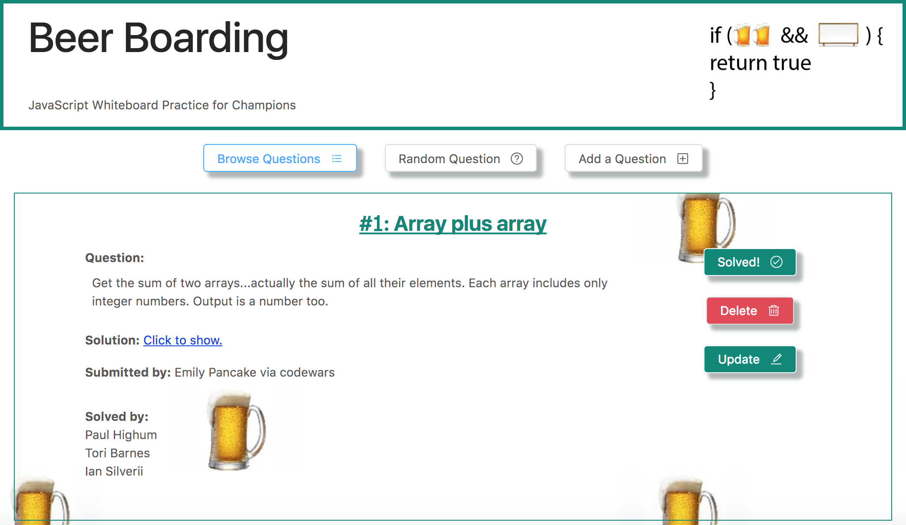

# Beer Boarding
Javascript whiteboarding practice for champions!

<div>
  
</div>

## App Description
An app that empowers junior developers looking to practice white-boarding interview skills with their friends.

## Problem Statement
The white board interview question is one of the most daunting scenarios for junior developers, and they need to practice. There currently isn't a clean interface that you can use to crowd-source *interview* questions and hide the answers. Code wars and other javascript practice environments have a different focus. In my time at Galvanize, we needed something where we could control the types of questions entered, generate random questions, and track who had already solved each one.

## The Solution
Beer Boarding is an app that allows users to input questions, generate a random question from the available questions, and track who submitted and solved each question.

## User Experience
Users can toggle three views, 1) Add a question, 2) Browse questions list, 3) Generate a random question. That part is self explanatory.

Additionally, users can toggle the solution so that it is hidden or visible. After a user solves a question, they can be added to the overall solvers list and then added to the "Solved by" list on any given question.

Finally Questions can be updated and deleted. Users can also be deleted, although they cannot be deleted if they are in a "Solved by" list. This is by design so that no data is inadvertently lost.

## Installation Instructions
Using the app only requires visiting the website, https://beerboardingg70.firebaseapp.com/.

However, if you wish to download the app and make changes to better suit your personal needs, you will find the source code for the front-end in this repository, and the code for the backend at: https://github.com/epancake/Beer-Boarding-Backend. After forking over your desired repo and cloning it down to your computer, please ```npm install``` then happy hacking!

## Technologies
React, Express, Knex, Postgresql, Node, Ant Design, Cypress.

## Author
Emily Pancake - Full Stack Web Developer

[GitHub](https://github.com/epancake)

[LinkedIn](www.linkedin.com/in/emilypancake/)

## License
MIT
